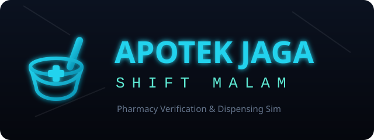
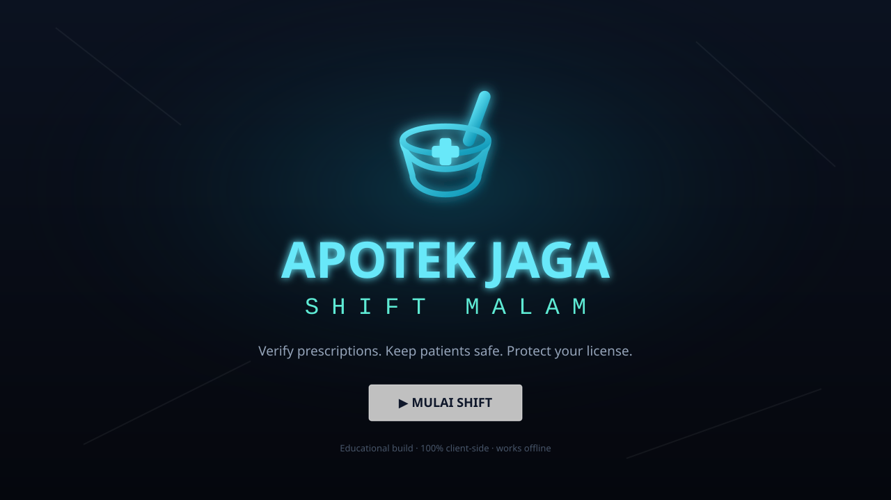
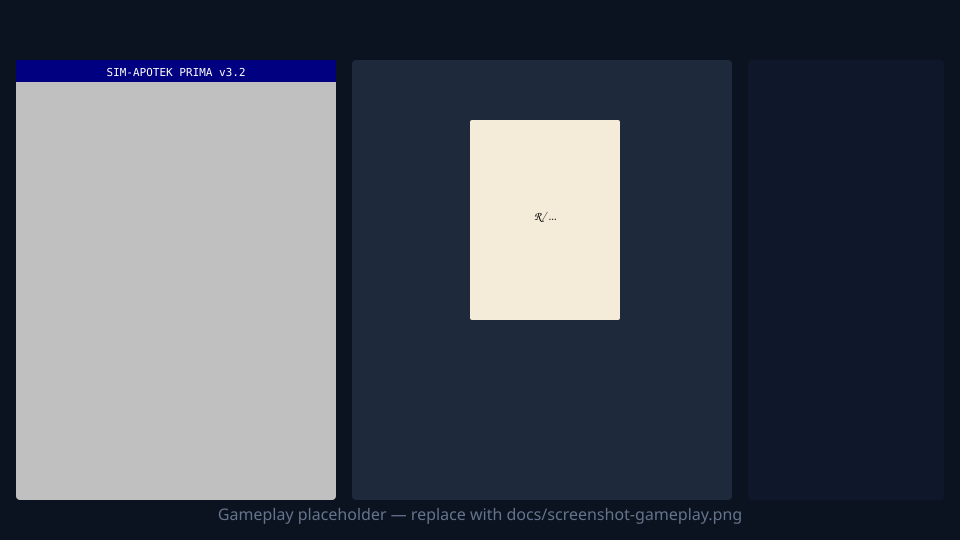

<p align="center">
  
</p>

<h1 align="center">Apotek Jaga: Shift Malam</h1>

<p align="center">
  <b>A first-person, tactile pharmacy prescription verification &amp; dispensing simulator.</b><br/>
  Educational · Indonesian community-pharmacy setting · 100% client-side · zero backend · zero AI at runtime.
</p>

<p align="center">
  
  
  
  
</p>

---

## What is this?

**Apotek Jaga: Shift Malam** ("Pharmacy Night Watch") is a document-verification game in the spirit of *Papers, Please*, set in the quiet, neon-lit night shift of an Indonesian community pharmacy (*apotek*).

You play a pharmacist. Patients slide prescriptions through the acrylic-glass window. You inspect each prescription, cross-check it against the retro pharmacy software (**SIM-Apotek Prima v3.2**), and decide: **dispense** or **refuse** — while keeping patients safe and your pharmacy's license intact.

It is built to be **educational**: every rule and trap mirrors real Indonesian pharmacy practice, and every mistake explains *which rule* was broken and *why*.

> ⚠️ This is an educational game/prototype. It is **not** medical or pharmaceutical advice. Doses, prices, and registrations are illustrative.

## Screenshots

> These are placeholders. See [`docs/README-media.md`](docs/README-media.md) to add your own captures.

| Title | Gameplay |
|---|---|
|  |  |

**Gameplay video:** _add `docs/gameplay.mp4` or paste a YouTube/Loom link here._

## Core gameplay loop

```
Patient arrives at the window
      │
      ▼
Hear the (muffled) complaint  +  receive the paper prescription (drag & zoom)
      │
      ▼
Cross-check in SIM-Apotek (F1–F4): drug class, stock, SIP lookup, interactions
      │
      ▼
Decide:  [A] ACCEPT   /   [D] REFUSE
      │
      ├─ Accept a valid Rx → (grind powder if compounded) → (copy-Rx if low stock) → pick label → dispense
      │
      ▼
Educational feedback → next patient → end-of-shift audit (pay, reputation, bills)
```

## Features

- **Tiered rules, one per day** (like *Papers, Please*), announced by a morning newspaper:
  - **R1** — prescription completeness (doctor, SIP, date, patient, R/, signature) + expiry
  - **R2** — drug class vs. prescription requirement (Keras / Psikotropika / Narkotika need an Rx)
  - **R3** — doctor authenticity via **SIP** lookup (registered? name match? expired?)
  - **R4** — spoken complaint vs. prescribed therapy (catches misuse & **LASA** confusion)
  - **R5** — pediatric **maximum daily dose** (Young / Dilling / Clark formulas)
- **Retro pharmacy GUI** — a WinForm-style *SIM-Apotek Prima v3.2* with a drug grid, SIP master, and drug-interaction alerts. Keyboard-driven (F1–F4).
- **Tactile dispensing:**
  - **Etiket** (label) color: white = internal/oral, blue = external/topical
  - **Puyer compounding** mini-game: grind tablets in the mortar with a circular cursor gesture
  - **Copy prescription (apograph, p.c.c)** with `det` / `ne det` when stock is short
- **OWA (Obat Wajib Apotek)** — certain Keras drugs a pharmacist may dispense without an Rx, within limits.
- **Procedural patients & traps** — panicking parent, controlled-substance tout, chronic (Prolanis) patient, pediatric powder, pediatric overdose, and undercover **Dinkes inspection** (mystery shopper).
- **Shift modifiers** — *Cakar Ayam* (near-illegible handwriting), *Waspada LASA* (look-alike/sound-alike traps), *Antrian Ramai* (busy night).
- **Diegetic economy** — salary, fines, daily bills, and a reputation meter; graduated warnings instead of instant game-over.
- **Synthesized audio** — stamp thud, paper slide, mortar grind, bell, and result cues via the Web Audio API (no audio files → tiny bundle).
- **100% client-side** — deploys as a static SPA. No server, no runtime AI, works offline.

## Pharmacy authenticity

The game encodes real practice (simplified for play):

- **Drug classes:** Bebas, Bebas Terbatas, Keras, Psikotropika, Narkotika, plus **OWA**.
- **Latin `signa`** abbreviations (`S 3 dd tab 1 p.c.`, `u.e.`, `p.r.n.`, `m.f. pulv dtd`, …) with an in-game dictionary.
- **SIP** issued by *Dinkes* (not IDI) — fakes are caught by unregistered numbers, name mismatches, or expiry.
- **Copy prescription / apograph** with `det` (dispensed) and `ne det` (not yet dispensed).
- **Pediatric dosing** via **Young** (age, &lt;8y), **Dilling** (age, 8–20y), **Clark** (body weight).
- **Major interactions** (e.g., Sildenafil + nitrate, Warfarin + Aspirin, benzodiazepine + opioid).

## Tech stack

| Layer | Choice |
|---|---|
| Framework | React 18 + TypeScript |
| Build | Vite 5 (static SPA output) |
| Styling | Tailwind CSS (retro WinForm theme) |
| State | Zustand |
| Audio | Web Audio API (synthesized SFX) |
| Deploy | Vercel (static) |

> The original brief specified Pixi.js + Howler.js. This prototype is **DOM/SVG-first** (the verification loop needs no WebGL) and uses **synthesized Web Audio** (no audio assets). A Pixi.js desk viewport is planned — see the roadmap.

## Getting started

```bash
# install
npm install

# run dev server (http://localhost:5173)
npm run dev

# type-check + production build (outputs to dist/)
npm run build

# preview the production build
npm run preview
```

Requirements: Node 18+.

### Controls

| Key | Action |
|---|---|
| `A` | Stamp **ACCEPT** |
| `D` | Stamp **REFUSE** |
| `F1`–`F4` | SIM-Apotek tabs (Tebus Resep / Formularium / Cek Stok / Master SIP) |
| `Enter` | Continue (feedback screen) |
| mouse | Drag & zoom the prescription; grind in the mortar; pick labels |

## Project structure

```
src/
  audio/            # Web Audio SFX engine
  components/       # UI: layout, SIM-Apotek, prescription, mortar, modals, screens
  data/             # formulary, doctor registry, latin dictionary, interactions, OWA
  game/             # generator, verification engine, dose calc, day rules, RNG, modifiers
  store/            # Zustand game store (phases, economy, flow)
  types/            # shared TypeScript types
docs/               # logo + media placeholders
```

## Deployment (Vercel)

This repo includes `vercel.json`. To deploy:

```bash
npm i -g vercel   # if needed
vercel            # preview
vercel --prod     # production
```

Or import the repo in the Vercel dashboard — framework preset **Vite**, build `npm run build`, output `dist`.

**Live demo:** _add your Vercel URL here after deploying._

## Roadmap

- [ ] Pixi.js desk viewport (scratched acrylic glass shader, powder particles)
- [ ] More archetypes (forgetful grandpa / visual drug matching)
- [ ] Generic substitution flow via the intercom
- [ ] Additional formulary, doctors, and multi-item interaction cases
- [ ] Localization (currently Bahasa Indonesia in-game with onboarding)

## Contributing

Contributions are welcome. The content is data-driven — you can add drugs, doctors, interactions, and patient archetypes with small edits under `src/data/` and `src/game/`. Please keep pharmacy facts accurate and cite sources in your PR when adding clinical content.

## License

[MIT](LICENSE) — free to use, modify, and learn from.

## Acknowledgements

Inspired by *Papers, Please* by Lucas Pope, and by the real, quiet dedication of Indonesian night-shift pharmacists.
